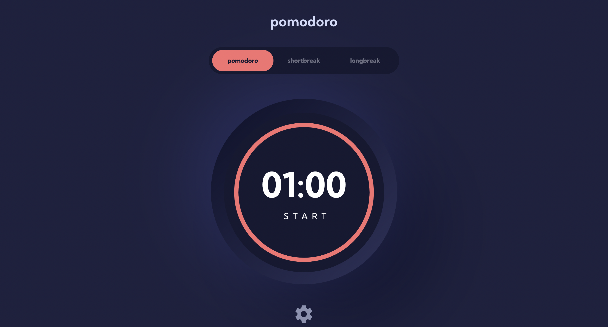

# Frontend Mentor - Pomodoro app solution

This is a solution to the [Pomodoro app challenge](https://www.frontendmentor.io/challenges/pomodoro-app-KBFnycJ6G) on Frontend Mentor

## Table of contents

-  [Overview](#overview)
   -  [The challenge](#the-challenge)
   -  [Screenshot](#screenshot)
   -  [Links](#links)
-  [My process](#my-process)
   -  [Built with](#built-with)
   -  [What I learned](#what-i-learned)
   -  [Continued development](#continued-development)
   -  [Useful resources](#useful-resources)
-  [Author](#author)
-  [Acknowledgments](#acknowledgments)

## Overview

### The challenge

Your users should be able to:

-  Set a Pomodoro timer and short & long break timers
-  Customize how long each timer runs for
-  See a circular progress bar that updates every minute and represents how far through their timer they are
-  Customize the appearance of the app with the ability to set preferences for colors and fonts

### Screenshot



### Links

-  Live Site URL:

## My process

### Built with

-  Semantic HTML5 markup
-  Flexbox
-  CSS Grid
-  Mobile-first workflow
-  [React](https://reactjs.org/) - JS library
-  [Styled Components](https://styled-components.com/) - For styles
-  Typescript

### What I learned

```tsx
export const TimerContextProvider = ({ children }: { children: ReactNode }) => {
   return (
      <TimerContext.Provider value={useTimer()}>
         {children}
      </TimerContext.Provider>
   )
}

export function useTimerContext() {
   const context = useContext(TimerContext)
   if (!context)
      throw new Error('useAppContext must be used within a AppContextProvider')
   return context
}
```

Context - multiple providers | sep folder | HOCs vs children for App context (+ custom hooks) | hook to use + return true if initialised inside its provider (TS destructuring solved) | sep files for types/interfaces (+ diff folder structure) | using in index.tsx vs App

Custom hooks with context - TS destructuring solved | great error msg | easy to lift up if problem

```tsx
export const ProgressCircle = styled.svg<Props>`
   stroke: ${({ theme: { currentTheme } }) => currentTheme.accent};
   stroke-width: 5
   stroke-dasharray: ${({ progressAmount }) => progressAmount}, 500;
   stroke-linecap: round;
   transition: stroke-dasharray 1s linear;
`

setProgressWidth((timerLength / 60 / current) * 500)
```

Circular progress bar -

```tsx
const updateTheme = (newTheme: string) => {
   setCurrentTheme(Theme[newTheme as keyof Omit<typeof Theme, 'baseStyles'>])
}

const produceColors = (colors: Partial<ColorThemes>) => {
   return Object.values(colors)
      .splice(1, 3)
      .map((color) => color.identifier)
}

declare module 'styled-components' {
   export interface DefaultTheme {
      baseStyles: typeof Theme['baseStyles']
      currentTheme: typeof Theme['redTheme']
      currentFont: typeof Fonts['ffKumbh']
      ...
   }
}
```

HOCs + TS - Omit utility type (+ generics) | fixing 'any' props - rare potential use case | diff with custom hooks - arguments HOC take outside target component scope (custom hook can take them within that scope) | add more components to tree + bloated syntax + props | example above - bracket notation with objects (ignoring other keys apart from those to target) | Partial utility type

Module Declarations - styled components (typing theme obj with declarations + intellisense/available in GlobalStyles)

```tsx
function reducer(state: UseTimerState, action: UseTimerActions) {
   switch (action.type) {
      case 'SET_INITIAL_TIMER_LENGTH':
         return { ...state, timerLength: action.amount }
         ...
   }
}
```

Reducers -

### Continued development

I have loved learning about custom hooks throughout this whole project and how versatile they are in refactoring our code. I can't wait to research more examples online and see how other developers have built their own to meet their specific needs.

I am further keen to research more into Reducers and how they relate to other technologies I plan to learn in the future, most notably Redux.

Reducers - more usecases + how that leads in Redux (apparently similar structure)

### Useful resources

-  [How to code a responsive circular percentage chart with SVG and CSS.](https://medium.com/@pppped/how-to-code-a-responsive-circular-percentage-chart-with-svg-and-css-3632f8cd7705) - This article served as a great tutorial for building out the circular progress bar, as well as a great reference point with my original solution where I used a conic-gradient instead.

-  [React Higher Order Components with TypeScript](https://isamatov.com/react-hoc-typescript/) - This article introduced me to the Omit utility type in Typescript, enabling me to properly type the props my higher-order components would recieve, as well as 'omitting' the logic which would also be passed down via props from the higher-order component itself.

## Author

-  Website - [Joshua Jameson-Wallis](https://joshuajamesonwallis.com)
-  Linkedin - [Joshua Jameson-Wallis]()
